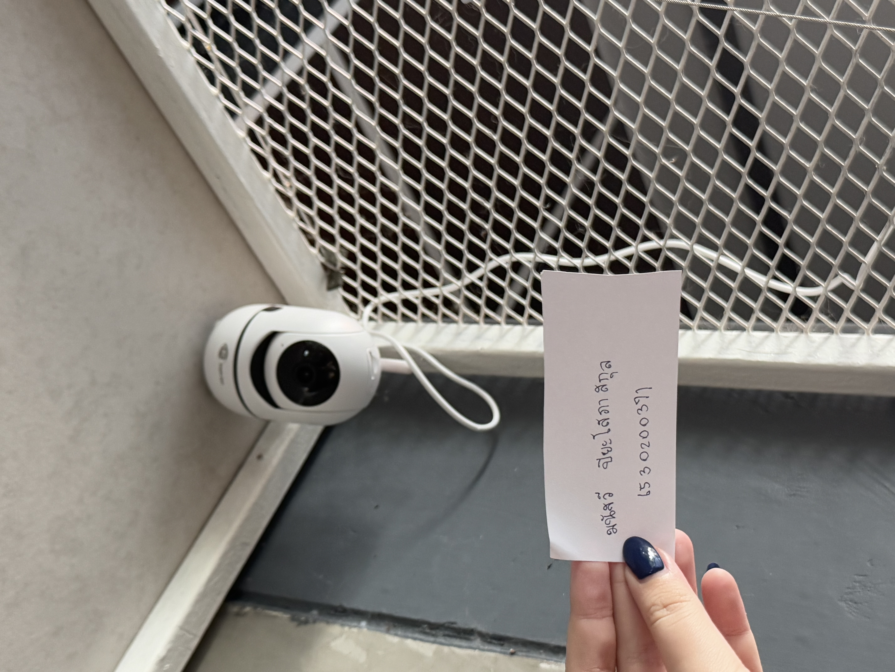

# 🚪 Security Control
## กล้องวงจรปิด (cctv)

- สถานที่: บ้าน
- Control Function: Detective 
- Type of Security Control: Physical Control
  - กล้องวงจรปิด (CCTV) เป็นการทำงานของระบบฟังก์ชัน Detective โดยที่กล่าวถึงนี้หมายถึงความสามารถในการตรวจจับหรือสังเกตสิ่งที่เกิดขึ้นในพื้นที่ ซึ่งเป็นการทำงานที่เน้นการติดตามและสืบสวนข้อมูลในภายหลัง เช่นการบันทึกวิดีโอที่สามารถนำมาวิเคราะห์หรือตรวจสอบเหตุการณ์ที่เกิดขึ้น โดยไม่จำเป็นต้องมีการตอบสนองในทันที แต่อาจช่วยในการหาข้อเท็จจริงหรือหลักฐานได้หลังจากเกิดเหตุการณ์
  - ทำไมกล้องวงจรปิดถึงเป็น Physical Control
    กล้องวงจรปิด (CCTV) ถูกจัดว่าเป็น Physical Control เพราะมันเป็นเครื่องมือที่ช่วยในการควบคุมและป้องกันพื้นที่จากการเข้าถึงหรือกิจกรรมที่ไม่ได้รับอนุญาต โดยการติดตั้งกล้องวงจรปิดสามารถช่วยตรวจสอบหรือบันทึกพฤติกรรมในพื้นที่ที่ต้องการความปลอดภัยได้จริง
    

